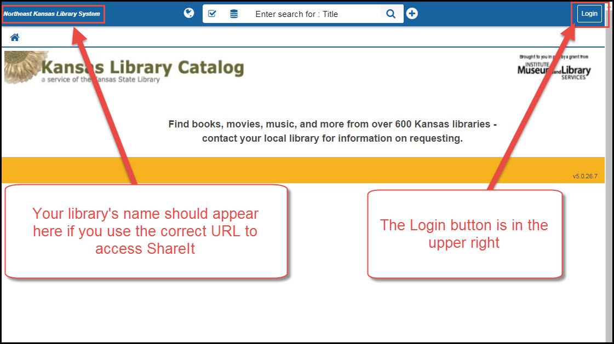

# Logging in

## ShareIt URLs

ShareIt requires that each library logs in from a specific URL.

The format for a ShareIt login URL is

[http://ksuc-agent.auto-graphics.com/mvc?cid=ksuc&lid=XXX&reset=over](http://ksuc-agent.auto-graphics.com/mvc?cid=ksuc&lid=XXX&reset=over)

The difference between one library's login and another's is that you have to substitute the XXX in the middle of the above URL with your library's OCLC organization symbol. If you do not know your library's OCLC organization symbol, it can be found at

[https://www.oclc.org/en/contacts/libraries.html](https://www.oclc.org/en/contacts/libraries.html)

## URL Troubleshooting

If you attempt to log into ShareIt and you do not get the normal login window, you can usually overcome the problem by logging into this alternate URLs

[http://ksuc-agent.auto-graphics.com/mvc?cid=ksuc&lid=XXX&reset=force](http://ksuc-agent.auto-graphics.com/mvc?cid=ksuc&lid=XXX&reset=force)

The difference between this URL and the previous one is that the last part of the URL is changed from "over" to "force"

## Next Search Catalog URL location

If you are a member of the Next consortium, you can find the ShareIt URL for your library on the left side of the home page in the staff client.

## ShareIt Usernames and Passwords

If you do not know your library's username and password for ShareIt, contact the NEKLS office or the State Library of Kansas.

## Example logon

