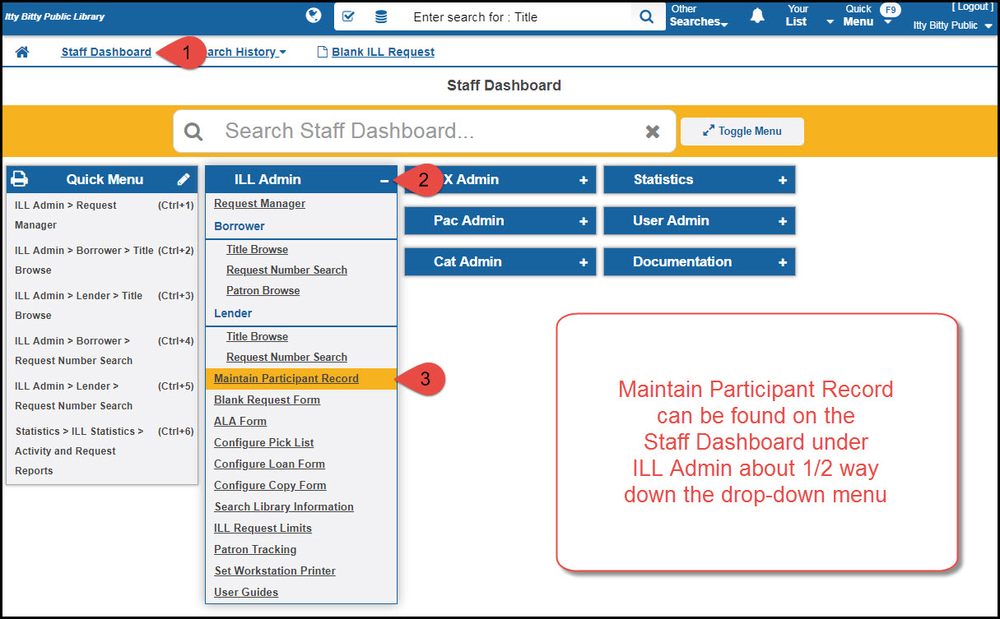

# Participant record

## Setting up your ShareIt patricipant record - Basic

Log into ShareIt as normal, then click on the link that says "Staff dashboard," then click on "ILL Admin," and, finally, choose "Maintain Participant Record" from the drop-down menu.

Once you're logged in, the basic setup for public libraries requires that you fill in the fields highlighted in green in this screenshot:

<a href="https://will1410.github.io/shareit/html/participant.record.html" target="\_blank">See detailed screenshot in a new window</a>
