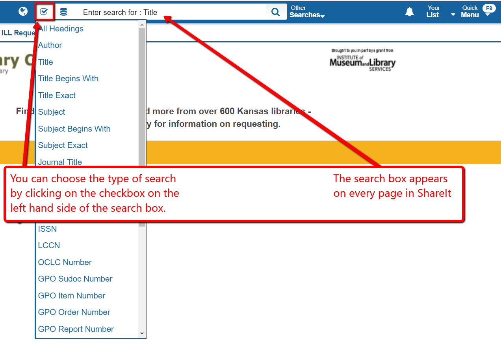
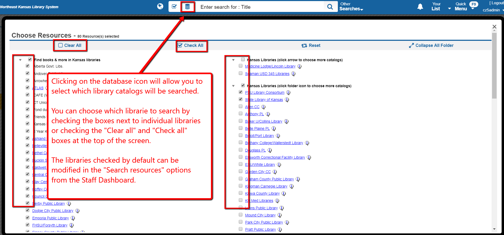
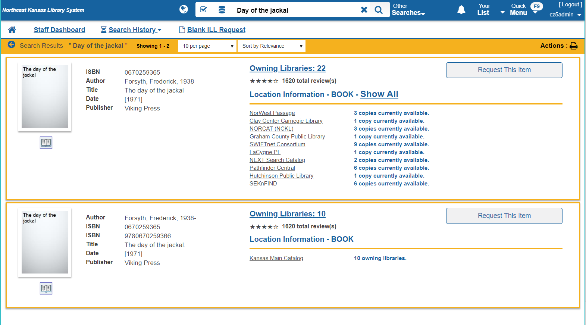

# Search and request

## Search basics

The search box appears at the top of every screen in ShareIt.

The search will automatically search the catalogs selected by default for your library.  The defaults can be changed from the "Search resources" menu on the staff dashboard.

## Search results

__Insert Day of the Jackal scrolled search.  Include facets; quick request; view details; and catalog name.__

## Detailed results 1

Clicking on "View details" will give you more detailed results.

## Detailed results 2

Clicking on the cover of an item will give you even more details.

__Insert screen shot of details 2 - include request; multi-copy; note the download link but don't describe it in any detail.__

# Requests

## Basic request

Once you find a title you want to borrow, click on the "Request this item" button to initiate a request.  This will bring up a request form:

__Include screenshot of the request form.__

## Requesting multi-copies

If you need to borrow multiple copies of a title (maybe for a book-club or classroom use) you can request multiple copies of a title.

__Include a screenshot of multiple request form.__

## Approve requests after they are made

After requests have been made, staff need to approve the requests.

__Include a screenshot of the approval process.__
